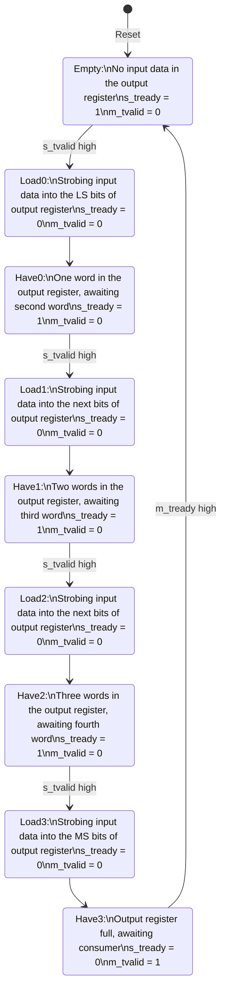

# State Diagram for Embiggener

This VHDL entity translates a 32-bit-wide AXI-S interface (DMA) to the 128-bit-wide interface (similar to AXI-S) expected by the DAC FIFO in the Analog Devices ADRV9371-ZC706 reference design.

